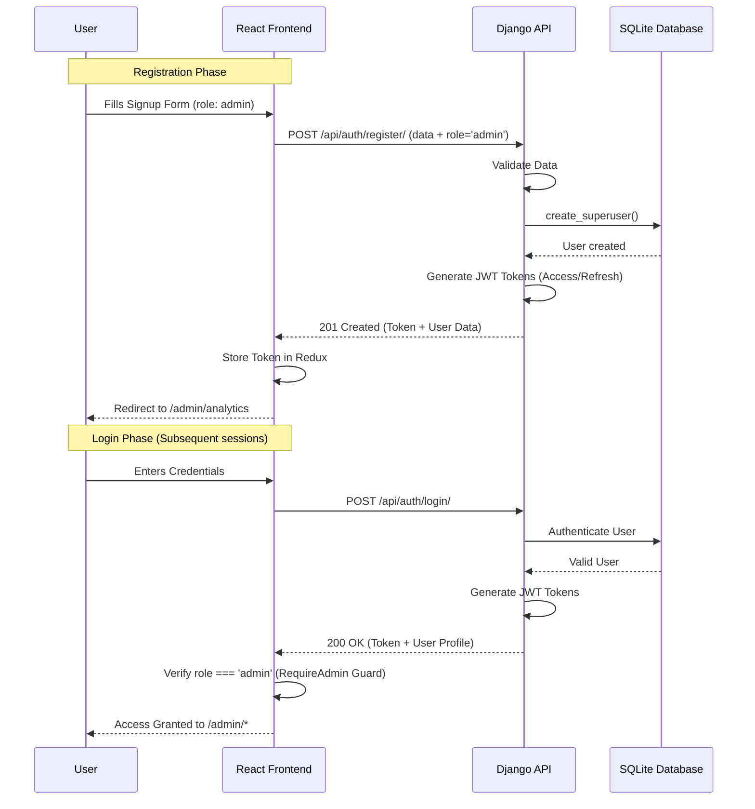

# EVER MILK - Milk Subscription & Delivery Platform

**EVER MILK** is a modern, premium milk subscription and delivery management system. It provides customers with a seamless way to order and subscribe to fresh milk, while offering administrators a powerful dashboard for managing products, orders, and analytics.

## 🚀 Tech Stack

### Frontend
- **Framework:** [React](https://reactjs.org/) + [Vite](https://vitejs.dev/)
- **State Management:** [Redux Toolkit](https://redux-toolkit.js.org/)
- **Styling:** [Tailwind CSS](https://tailwindcss.com/)
- **Animations:** [Framer Motion](https://www.framer.com/motion/)
- **Charts:** [Recharts](https://recharts.org/)

### Backend
- **Framework:** [Django](https://www.djangoproject.com/) + [Django Rest Framework (DRF)](https://www.django-rest-framework.org/)
- **Database:** SQLite (Development)
- **Authentication:** JWT (JSON Web Tokens)
- **Payment Integration:** Razorpay (Optional)

---

## 🛠️ Getting Started

### Prerequisites
- Python 3.10+
- Node.js 18+
- npm or yarn

### Backend Setup
1. Navigate to the `backend` directory:
   ```bash
   cd backend
   ```
2. Create and activate a virtual environment:
   ```bash
   python -m venv venv
   source venv/Scripts/activate  # Windows
   # or
   source venv/bin/activate      # Linux/macOS
   ```
3. Install dependencies:
   ```bash
   pip install -r requirements.txt
   ```
4. Run migrations:
   ```bash
   python manage.py migrate
   ```
5. Start the server:
   ```bash
   python manage.py runserver
   ```

### Frontend Setup
1. Navigate to the `frontend` directory:
   ```bash
   cd frontend
   ```
2. Install dependencies:
   ```bash
   npm install
   ```
3. Start the development server:
   ```bash
   npm run dev
   ```

---

## 🔑 Admin Access

### 1. Django Admin (Backend)
- **URL:** `http://127.0.0.1:8000/admin/`
- **Username:** Your Superuser Email.
- Create a superuser via: `python manage.py createsuperuser`

### 2. Custom Admin Portal (Frontend)
- **URL:** `http://localhost:5173/admin/login`
- **Admin Signup:** `http://localhost:5173/admin/signup`

---

## 📦 Project Structure

- `backend/`: Django project containing core logic, database models, and API endpoints. 
- `frontend/`: React application containing the user interface and admin dashboard.

---

## 🔄 Admin Registration & Login Flow

The following diagram illustrates the interaction between the React Frontend and the Django Backend during administrator account creation and subsequent login.


