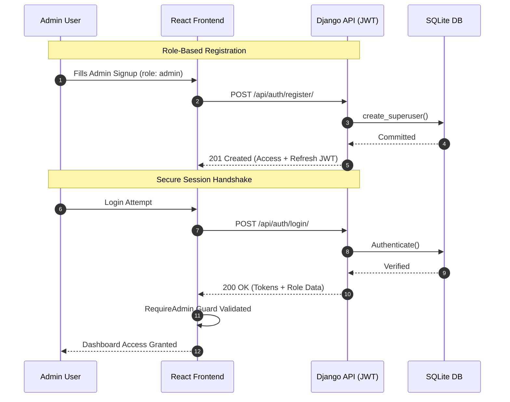

# <p align="center"> EVER MILK</p>
<p align="center">
  <strong>The Ultra-Premium Milk Subscription & Delivery Evolution</strong>
</p>

<p align="center">
  
  
  
  
</p>

---

##  Project Overview

**EVER MILK** isn't just a delivery service; it's a high-performance orchestration engine for fresh dairy logistics. Built with a robust **Django REST Framework** backend and a lightning-fast **React + Vite** frontend, it bridges the gap between farmhouse freshness and digital convenience.

### 🌟 Core Capabilities
- 🚀 **Automated Scheduling**: Adaptive delivery engine that generates schedules based on subscription logic.
- 🔐 **Secure Auth Architecture**: Multi-layered JWT authentication for Users and Power-User Admins.
- 📊 **Real-time Analytics**: High-fidelity dashboard for monitoring subscriptions, orders, and delivery metrics.
- ⏸️ **Smart Pause/Resume**: Intelligent delivery postponement with automatic schedule recalibration.
- 💳 **Transaction Integrity**: Atomic database transactions ensuring zero-loss order processing.

---

## 🏗️ System Architecture & Logic Flows

### 1. 🛡️ Authentication & Authorization (Admin Layer)
The system leverages a "Role-Based Secure Guard" pattern to ensure administrative actions are cryptographically verified.



### 2. 📅 Subscription Lifecycle & Delivery Orchestration
When a user activates a subscription, the engine triggers a complex state machine that calculates pricing, applies discounts, and pre-allocates a multi-day delivery schedule.

```mermaid
sequenceDiagram
    autonumber
    participant User
    participant FE as React Frontend
    participant BE as Subscription Service
    participant SCHED as Schedule Engine
    participant PMT as Payment Service
    participant DB as PostgreSQL/SQLite

    User->>FE: Select Product (Plan: Monthly/Daily)
    FE->>BE: POST /api/subscriptions/create/
    
    rect rgb(20, 20, 20)
        Note right of BE: Atomic Transaction Start
        BE->>BE: Calculate Multi-tier Discount
        BE->>DB: Create Subscription Record
        BE->>SCHED: Invoke(generate_delivery_schedule)
        SCHED->>DB: Bulk Create N-Day Delivery Intervals
        BE->>DB: Initialize Order/OrderItem for Payment Tracking
        Note right of BE: Atomic Transaction Commit
    end
    
    BE-->>FE: Return Sub_ID + Order_ID
    FE->>PMT: POST /api/payments/verify/
    PMT->>DB: Set Status: COMPLETED
    PMT-->>FE: Activation Notification Sent
```



---

## 🛠️ Tech Stack & Dependencies

### 🎨 Frontend Excellence
| Technology | Usage |
| :--- | :--- |
| **React 18** | Reconciler & Component Logic |
| **Redux Toolkit** | Global State & API Caching |
| **Tailwind CSS** | Atomic Design & Styling |
| **Framer Motion** | Micro-interactions & Anims |
| **Recharts** | Business Intelligence Visualization |

### ⚙️ Backend Engineering
| Technology | Usage |
| :--- | :--- |
| **Django 5.0** | Core Meta-Framework |
| **REST Framework**| Hypermedia API Architecture |
| **SimpleJWT** | Stateless Authentication |
| **Safe Transaction**| ACID Compliance Layers |

---

##  Getting Started

### 📦 Installation Matrix

#### 🔹 Ground Control (Backend)
```bash
# Clone the repository
git clone https://github.com/bhushantile20/milk_subscription.git

# Initialize Virtual Env
cd backend
python -m venv venv
source venv/bin/activate # Windows: venv\Scripts\activate

# Install Core Engine
pip install -r requirements.txt

# Migrate Database Schema
python manage.py migrate
python manage.py createsuperuser

# Ignition
python manage.py runserver
```

#### 🔹 Visual Terminal (Frontend)
```bash
cd frontend

# Install Node Modules
npm install

# Start Dev Cluster
npm run dev
```

---

## 📁 Repository Structure
```bash
.
├── backend                 # Django Core Logic
│   ├── accounts            # JWT & User Profiles
│   ├── subscriptions       # Scheduling & Life-cycle Engine
│   ├── orders              # Transactional Logic
│   └── payments            # Financial Integration
├── frontend                # React System
│   ├── src/components      # UI Primitives
│   ├── src/pages           # View Assemblies
│   └── src/store           # Redux Slices
└── DEPLOYMENT.md           # Production Blueprint
```

---
